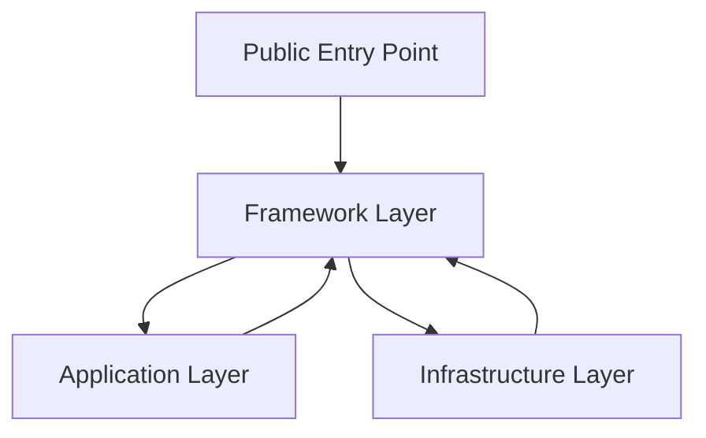

# CodeWiki: SottoMonte Framework

Benvenuto nella documentazione tecnica del framework SottoMonte. Questa Wiki fornisce una panoramica dell'architettura, dei componenti principali e dei pattern di design utilizzati nel progetto.

## 🏗️ Architettura del Sistema

Il progetto segue un'architettura stratificata ispirata ai principi della Clean Architecture e del Domain-Driven Design (DDD).

### Struttura delle Cartelle
- `src/framework`: Il cuore del sistema. Contiene l'engine di orchestrazione, il caricatore dinamico e le utility di base.
- `src/infrastructure`: Adattatori per servizi esterni (database, messaggistica, presentazioni).
- `src/application`: Logica di business organizzata in Model, Action, Policy e Repository.
- `public`: Punti di ingresso dell'applicazione (es. `main.py`).
- `doc`: Documentazione dettagliata in formato Markdown (IT/EN).

---

## 🚀 Framework Core (`src/framework`)

Il framework è progettato per essere asincrono, modulare e guidato dai dati.

### 🧩 Orchestrazione (`flow.py`)
L'engine principale utilizza il pattern **Pipeline**.
- **`pipe(*stages)`**: Esegue una sequenza di step in modo dichiarativo.
- **`step(func, *args, **kwargs)`**: Definisce una singola unità di esecuzione.
- **`asynchronous` / `synchronous`**: Decoratori per gestire il contesto della transazione, la normalizzazione dell'output e il logging automatico. Include l'instrumentazione automatica per OpenTelemetry.
- **Utility**: `get`, `put`, `convert`, `normalize` per la manipolazione sicura dei dati basata su schemi.

### 📡 Osservabilità e Telemetria
Il framework integra nativamente **OpenTelemetry** per il monitoraggio dei flussi.
- **Auto-Instrumentation**: Ogni pipeline e ogni funzione decorata con `@asynchronous` genera automaticamente degli Span di tracciamento.
- **Configurazione**: Gestita tramite la sezione `[telemetry]` in `pyproject.toml`.
- **Adattatore**: `src/infrastructure/message/otel.py` gestisce l'integrazione con l'SDK OTel.

### 📜 Domain-Specific Language (`language.py`)
Include un parser DSL basato su `Lark` per definire configurazioni e logiche di business in un formato leggibile. Supporta:
- Espressioni piped (`|`).
- Operazioni logiche e matematiche.
- Integrazione con funzioni Python tramite `DSLVisitor`.

### 🛡️ Contract-Driven Dependency Filter (CDDF) (`load.py`)
Meccanismo di caricamento dinamico che garantisce sicurezza e integrità:
- **Validazione Hash**: Ogni modulo `.py` può avere un `.contract.json` che contiene gli hash dei metodi validati.
- **Isolamento**: Solo i metodi testati e dichiarati in `exports` (nel file `.test.py`) vengono effettivamente esposti all'applicazione.
- **Dependency Injection**: Utilizza `dependency-injector` per gestire singleton e factory.

---

## 🛠️ Infrastructure Layer (`src/infrastructure`)

Gli adattatori traducono le chiamate del framework per servizi specifici.
- **Persistence**: Redis, Supabase, File System.
- **Message**: Console, WebSocket, API esterne.
- **Presentation**: Starlette (Web), Flutter (Native).
- **Authentication/Authorization**: Supabase, OAuth (GitHub), Verdict.

I provider vengono registrati dinamicamente durante la fase di **Bootstrap** definita in `pyproject.toml`.

---

## 📱 Application Layer (`src/application`)

La logica di business è separata dagli aspetti infrastrutturali.
- **Action**: Comandi e flussi di lavoro.
- **Model**: Definizioni dei dati (DTO).
- **Repository**: Interfacce per l'accesso ai dati.
- **Policy**: Regole di business e autorizzazioni.

---

## 🧪 Sviluppo e Qualità

### Pattern del Contratto
Per ogni file `modulo.py`:
1. `modulo.test.py`: Contiene i test unitari e la definizione degli `exports`.
2. `modulo.contract.json`: Generato automaticamente (o manualmente) per bloccare la versione del codice validata.

### Generazione dei Contratti
Usa `generate_contracts.py` per aggiornare i file di contratto dopo aver modificato il codice e superato i test.

---

## 🛠️ Tooling
- **`repair_contracts.py`**: Utility per correggere eventuali mismatch di hash durante lo sviluppo.
- **`main.py`**: Entry point che inizializza il container e avvia il bootstrap.

---
> [!TIP]
> Per approfondire, consulta la cartella `doc/` dove troverai guide specifiche per ogni layer e tutorial per iniziare.
